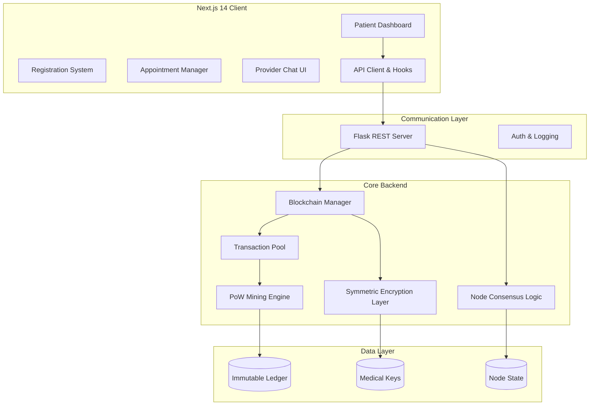

# Hack Knight '25: Secure Blockchain-Based Healthcare Management

[](https://opensource.org/licenses/MIT)
[](https://www.python.org/downloads/)
[](https://nextjs.org/)
[](https://www.typescriptlang.org/)
[](https://bun.sh/)
[](https://tailwindcss.com/)

Hack Knight '25 is a decentralized healthcare management ecosystem that leverages blockchain technology to ensure the integrity, security, and portability of medical records. By combining a robust Python-based blockchain backend with a high-performance Next.js frontend, the platform provides a transparent, immutable ledger for patient data, medical appointments, and provider interactions.

## Table of Contents

- [Overview](#overview)
- [Features](#features)
- [Architecture](#architecture)
- [Quick Start](#quick-start)
- [Usage](#usage)
- [Configuration](#configuration)
- [API Reference](#api-reference)
- [Development](#development)
- [Contributing](#contributing)
- [Roadmap](#roadmap)
- [License](#license)

---

## Overview

Traditional healthcare data management systems often suffer from fragmentation, lack of interoperability, and vulnerability to centralized points of failure. **Hack Knight '25** addresses these challenges by implementing a custom-built blockchain tailored for healthcare.

The system utilizes a **Proof-of-Work (PoW)** consensus mechanism to secure the ledger. Every medical record added to the system is hashed, linked to previous blocks, and distributed across the network nodes. With integrated **Fernet symmetric encryption**, sensitive patient data remains confidential, accessible only to authorized entities holding the decryption keys.

---

## Features

### Core Blockchain Engine
- **Custom Blockchain Core**: Native implementation of a linked-block structure with SHA-256 cryptographic hashing.
- **Proof-of-Work (PoW)**: Robust mining algorithm (Nonce-based) ensures network security and prevents record tampering.
- **Immutable Ledger**: Once a medical record is mined into a block, it cannot be altered without recalculating every subsequent hash.
- **Consensus Logic**: Automatic conflict resolution utilizing the "Longest Chain Rule" for multi-node synchronization.

### Healthcare & Security
- **Medical Encryption Layer**: Integrated symmetric encryption (via `medical_encryption.key`) to protect Protected Health Information (PHI) at rest.
- **Healthcare Data Models**: Specialized schemas for appointments, patient registration, and provider credentials.
- **Auditability**: Complete, timestamped history of every medical transaction.

### Modern Web Experience
- **Next.js 14 Dashboard**: A high-performance, React-based interface for patients and providers.
- **Real-time Blockchain Metrics**: Visual representation of chain height, mining difficulty, and transaction volume.
- **Responsive UI/UX**: Built with Radix UI, Tailwind CSS, and Shadcn/UI for a seamless mobile and desktop experience.
- **Storybook Integration**: Documented and isolated UI component development.

---

## Architecture

The project follows a decoupled micro-service architecture, separating the cryptographic heavy-lifting of the blockchain from the user-facing application.



---

## Quick Start

### Prerequisites
- **Python**: 3.9+
- **Node.js**: 18+ or **Bun** (Recommended)
- **Git**

### 1. Installation

Clone the repository and install dependencies for both the frontend and the blockchain service.

```bash
# Clone the repository
git clone https://github.com/WomB0ComB0/hack-knight-25.git
cd hack-knight-25

# Install Frontend dependencies
cd frontend
bun install

# Install Backend dependencies
cd ../blockchain
pip install -r requirements.txt
```

### 2. Launching the Services

You can start the services independently or use a process manager like `concurrently`.

**Start the Blockchain Backend:**
```bash
cd blockchain
python app.py
```
*Backend runs on: `http://localhost:5000`*

**Start the Next.js Frontend:**
```bash
cd frontend
bun run dev
```
*Frontend runs on: `http://localhost:3000`*

---

## Usage

### Mining a Block
New medical transactions are held in a "mempool" until they are mined. To finalize transactions and secure them into the ledger:
```bash
curl -X GET http://localhost:5000/mine
```

### Adding a Medical Record
Submit a POST request with the transaction details. The `medical_data` field is encrypted before storage.
```bash
curl -X POST -H "Content-Type: application/json" \
-d '{
  "sender": "Doctor_ID_082",
  "recipient": "Patient_UUID_44",
  "amount": 1,
  "medical_data": "Diagnosis: Type II Diabetes. Recommendation: Low glycemic diet."
}' \
http://localhost:5000/transactions/new
```

### Registering Network Nodes
To form a cluster, register neighbor nodes:
```bash
curl -X POST -H "Content-Type: application/json" \
-d '{
  "nodes": ["http://192.168.1.15:5000"]
}' \
http://localhost:5000/nodes/register
```

---

## Configuration

### Backend Configuration (`blockchain/config.ini`)
| Parameter | Description | Default |
| :--- | :--- | :--- |
| `difficulty` | Number of leading zeros required for hash | `4` |
| `mining_reward` | Tokens granted to the miner | `1` |
| `node_identifier` | Unique UUID for the current node | `random-uuid` |

### Frontend Environment (`frontend/.env`)
```env
NEXT_PUBLIC_BLOCKCHAIN_API=http://localhost:5000
NEXT_PUBLIC_APP_URL=http://localhost:3000
```

---

## API Reference

### Blockchain Core API
| Endpoint | Method | Description |
| :--- | :--- | :--- |
| `/chain` | GET | Returns the full blockchain ledger and current length. |
| `/mine` | GET | Triggers the mining process for pending transactions. |
| `/transactions/new` | POST | Creates a new transaction (medical record). |
| `/nodes/register` | POST | Adds new nodes to the network list. |
| `/nodes/resolve` | GET | Implements consensus algorithm to resolve chain conflicts. |

### Application/Service API
| Endpoint | Method | Description |
| :--- | :--- | :--- |
| `/api/appointments` | GET/POST | Manage healthcare scheduling data. |
| `/api/health` | GET | Returns status of the frontend server and backend connectivity. |

---

## Development

### Directory Structure
```text
├── blockchain/               # Python Flask Backend
│   ├── app.py                # REST API Routing
│   ├── blockchain.py         # Blockchain logic & Proof-of-Work
│   ├── auth_service.py       # Identity management
│   ├── blockchain_structure.py # Data classes for Blocks/Transactions
│   └── medical_encryption.key # Key file for Fernet encryption
└── frontend/                 # Next.js Application
    ├── src/app/              # Next.js App Router
    ├── src/components/       # UI Components (Shadcn/UI)
    ├── src/hooks/            # Custom React Hooks
    ├── src/utils/            # API & Logger utilities
    └── .storybook/           # UI Component documentation
```

### UI Component Standards
We use **Atomic Design** principles.
1. **Atoms**: Base UI components (Buttons, Inputs) in `src/components/ui`.
2. **Molecules**: Combined components (Search bar, Card headers).
3. **Organisms**: Feature-rich blocks (Patient Dashboard, Registration Form).

To view components in isolation:
```bash
cd frontend
bun run storybook
```

---

## Contributing

1. **Fork** the repository.
2. **Create a Feature Branch**: `git checkout -b feature/amazing-feature`.
3. **Commit Your Changes**: `git commit -m 'Add some amazing feature'`.
4. **Push to the Branch**: `git push origin feature/amazing-feature`.
5. **Open a Pull Request**.

Please ensure your Python code adheres to PEP 8 and your TypeScript code passes the ESLint configuration.

---

## Roadmap

- [ ] **HL7 FHIR Integration**: Native support for healthcare interoperability standards.
- [ ] **Zero-Knowledge Proofs (ZKP)**: Verify patient identity without revealing PII.
- [ ] **Mobile Application**: Dedicated React Native app for patient access.
- [ ] **Smart Contracts**: Automated insurance claim processing.
- [ ] **Multi-Sig Auth**: Require both doctor and patient signatures for record access.

---

## License

Distributed under the MIT License. See `LICENSE` for more information.

---
**Disclaimer**: This project was developed for Hack Knight '25. It is intended for demonstration purposes and should be subjected to a full security audit before being used with real-world PHI (Protected Health Information).