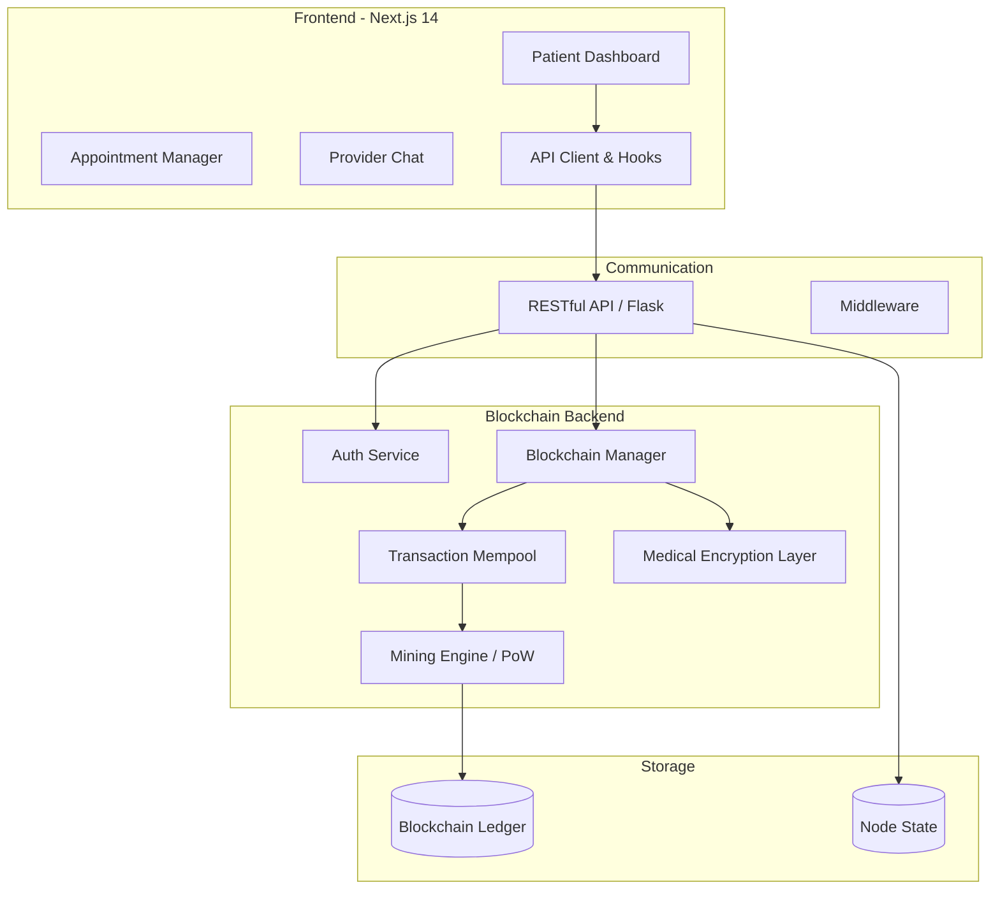

Hack Knight '25: Secure Blockchain-Based Healthcare Management

[](https://choosealicense.com/licenses/mit/)
[](https://www.python.org/downloads/)
[](https://nextjs.org/)
[](https://www.typescriptlang.org/)
[](https://bun.sh/)
[](https://tailwindcss.com/)

## Table of Contents
1. [Overview](#overview)
2. [Key Features](#key-features)
3. [Architecture](#architecture)
4. [Tech Stack](#tech-stack)
5. [Quick Start](#quick-start)
6. [Usage](#usage)
7. [Configuration](#configuration)
8. [API Reference](#api-reference)
9. [Development](#development)
10. [Roadmap](#roadmap)
11. [Contributing](#contributing)
12. [License](#license)

---

## Overview

**Hack Knight '25** is a production-grade, full-stack implementation of a decentralized healthcare ledger system. Developed to address the critical needs of data integrity, security, and interoperability in the medical field, the platform utilizes a custom-built Python blockchain backend coupled with a modern Next.js frontend.

The system ensures that medical records are immutable, timestamped, and cryptographically secured. By employing a Proof-of-Work (PoW) consensus mechanism and a robust encryption layer, it provides a transparent yet private ecosystem where patients own their data and healthcare providers can verify medical histories without centralized points of failure.

---

## Key Features

- **Custom Blockchain Engine**: A native Python implementation featuring SHA-256 hashing, linked block structures, and a persistent ledger.
- **Proof-of-Work (PoW)**: A nonce-based mining algorithm that secures the network against tampering.
- **Medical Record Encryption**: Built-in encryption logic (`medical_encryption.key`) to ensure sensitive patient information is never stored in plaintext on the ledger.
- **Distributed Consensus**: Automatic conflict resolution using the "Longest Chain" rule, allowing multiple nodes to synchronize state across the network.
- **Healthcare Specific Data Models**: Specialized structures for appointments, patient histories, and provider credentials defined in `healthcare_structure.py`.
- **Modern Patient Dashboard**: A high-fidelity React interface featuring health summaries, appointment scheduling, and real-time blockchain status visualizations.
- **Responsive UI Components**: A comprehensive library of accessible components built with Radix UI and Shadcn/UI, including data tables, charts, and interactive cards.
- **Integrated Chat System**: A built-in interface for patient-provider communication.

---

## Architecture

The project follows a decoupled client-server architecture. The Python backend manages the cryptographic ledger and peer-to-peer logic, while the Next.js frontend handles the user experience and provides a bridge to the blockchain API.



---

## Tech Stack

### Backend (Blockchain & API)
- **Language**: Python 3.9+
- **Framework**: Flask (Web Server Gateway)
- **Security**: SHA-256 Hashing, Fernet Symmetric Encryption
- **Package Management**: Pipenv / Requirements.txt
- **Logic**: Custom Peer-to-Peer Node Discovery & Consensus

### Frontend (User Interface)
- **Framework**: Next.js 14 (App Router)
- **Language**: TypeScript (Strict Mode)
- **Styling**: Tailwind CSS
- **UI Library**: Shadcn/UI, Radix UI, Lucide React
- **Development Tooling**: Bun, Storybook, PostCSS

---

## Quick Start

### Prerequisites
- Python 3.9 or higher
- Bun (recommended) or Node.js 18+
- Git

### 1. Clone the Repository
```bash
git clone https://github.com/WomB0ComB0/hack-knight-25.git
cd hack-knight-25
```

### 2. Install Dependencies

**Root & Frontend:**
```bash
bun install
```

**Backend:**
```bash
cd blockchain
pip install -r requirements.txt
```

### 3. Run the Application
The project includes a root-level `package.json` that uses `concurrently` to launch both the backend and frontend with a single command:

```bash
# From the project root
bun run dev
```

The services will be available at:
- **Frontend**: [http://localhost:3000](http://localhost:3000)
- **Blockchain API**: [http://localhost:5000](http://localhost:5000)

---

## Usage

### Mining Medical Records
To finalize a set of medical transactions and add them to the ledger, a "Mining" operation must be triggered. This can be done via the UI or via API:
```bash
curl -X GET http://localhost:5000/mine
```

### Submitting Patient Data
Transactions represent health events. To add a new record to the pending pool:
```bash
curl -X POST -H "Content-Type: application/json" \
-d '{
  "sender": "Clinic_Main",
  "recipient": "Patient_UUID_123",
  "amount": 1, 
  "medical_data": "Encrypted_String_Here"
}' \
http://localhost:5000/transactions/new
```

### Network Synchronization
If running multiple nodes, use the resolution endpoint to ensure the local node has the most recent valid chain:
```bash
curl -X GET http://localhost:5000/nodes/resolve
```

---

## Configuration

### Backend (`blockchain/config.ini`)
Configures the operational parameters of the blockchain.
- `difficulty`: Set PoW difficulty (default `4`). Higher values increase mining time.
- `reward`: The amount awarded to the node for mining a block.

### Frontend Environment (`frontend/.env`)
Create a `.env` file in the `frontend` directory:
```env
NEXT_PUBLIC_BLOCKCHAIN_API=http://localhost:5000
NEXT_PUBLIC_APP_URL=http://localhost:3000
```

---

## API Reference

### Blockchain Core
| Endpoint | Method | Description |
| :--- | :--- | :--- |
| `/chain` | GET | Returns the full blockchain (list of blocks). |
| `/mine` | GET | Initiates PoW and mines a new block. |
| `/transactions/new` | POST | Adds a new medical transaction to the mempool. |
| `/nodes/register` | POST | Accepts a list of new nodes in JSON format. |
| `/nodes/resolve` | GET | Consensus algorithm: resolves conflicts by taking the longest chain. |

### Healthcare Specific
| Endpoint | Method | Description |
| :--- | :--- | :--- |
| `/api/appointments` | GET | Fetch scheduled medical appointments. |
| `/api/appointments` | POST | Create a new appointment entry. |
| `/api/health` | GET | Returns the status of the blockchain node connection. |

---

## Development

### Directory Structure
```text
├── blockchain/            # Python Flask Backend
│   ├── blockchain.py      # Core Blockchain implementation
│   ├── app.py             # Flask API routes and server
│   ├── auth_service.py    # Identity and Access Management
│   └── healthcare_structure.py # Medical data schemas
├── frontend/              # Next.js Application
│   ├── src/app/           # App Router (Pages & API routes)
│   ├── src/components/    # Reusable UI components
│   ├── src/lib/           # Utility functions (shadcn/ui utils)
│   └── src/hooks/         # Custom React hooks (use-toast, etc.)
└── package.json           # Root scripts for development
```

### Component Documentation (Storybook)
The frontend uses Storybook for isolated component development and testing. To view the component library:
```bash
cd frontend
bun run storybook
```

### Encryption Key Management
The `medical_encryption.key` file in the `blockchain/` folder is essential for decrypting patient data. Ensure this file is backed up securely and never committed to public repositories in a production environment.

---

## Roadmap

- [ ] **Zero-Knowledge Proofs (ZKP)**: Implement ZKPs for age or condition verification without revealing identity.
- [ ] **Decentralized Identifiers (DIDs)**: Integrate W3C standard DIDs for patients and doctors.
- [ ] **Multi-Signature Approvals**: Require both doctor and patient signatures for record modification.
- [ ] **IPFS Storage Layer**: Transition from on-chain data storage to IPFS hashes for large medical files (e.g., DICOM images).
- [ ] **Governance Token**: Introduce a utility token for incentivizing research data sharing.

---

## Contributing

Contributions are welcome to help improve the security and efficiency of the healthcare ledger.

1. **Fork** the repository.
2. **Create** a feature branch (`git checkout -b feature/AmazingFeature`).
3. **Commit** your changes (`git commit -m 'Add some AmazingFeature'`).
4. **Push** to the branch (`git push origin feature/AmazingFeature`).
5. **Open** a Pull Request.

---

## License

Distributed under the **MIT License**. See `LICENSE` in the root directory for more information.

---

**Disclaimer**: This project was developed for Hack Knight '25. While it demonstrates robust blockchain principles, it should undergo thorough security audits before being used for actual Protected Health Information (PHI) in a regulated environment.