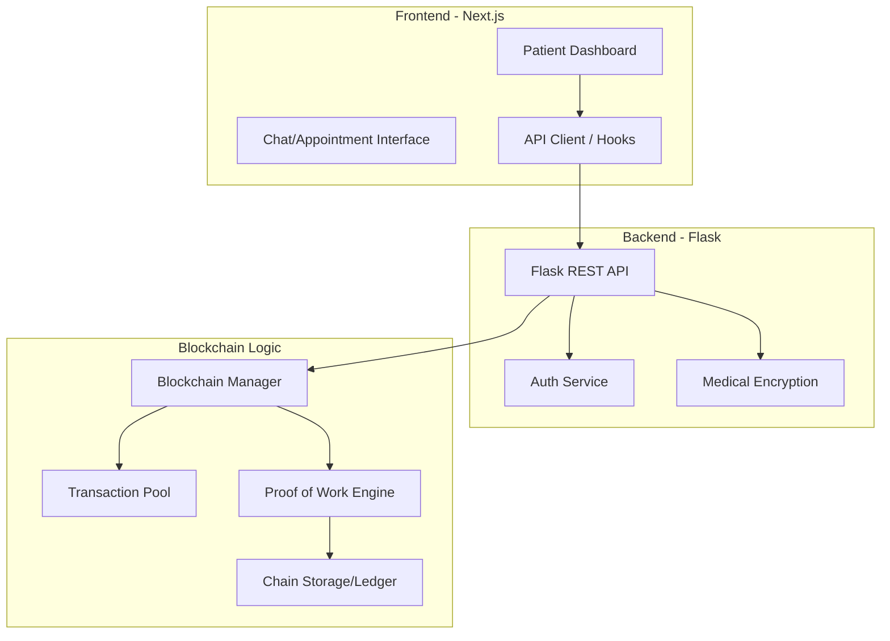

Hack Knight '25: Secure Blockchain-Based Healthcare Management

[](https://choosealicense.com/licenses/mit/)
[](https://www.python.org/downloads/)
[](https://nextjs.org/)
[](https://www.typescriptlang.org/)
[](https://bun.sh/)

---

## Table of Contents
1. [Overview](#overview)
2. [Key Features](#key-features)
3. [Architecture](#architecture)
4. [Tech Stack](#tech-stack)
5. [Quick Start](#quick-start)
6. [Usage](#usage)
7. [Configuration](#configuration)
8. [API Reference](#api-reference)
9. [Development](#development)
10. [Roadmap](#roadmap)
11. [Contributing](#contributing)
12. [License](#license)

---

## Overview

**Hack Knight '25** is a comprehensive, full-stack implementation of a decentralized healthcare ledger. At its core, it leverages a custom-built Python blockchain to maintain immutable, encrypted medical records. By combining the security of Proof-of-Work (PoW) with a modern React-based frontend, the platform provides a transparent yet private ecosystem for patients and healthcare providers to manage appointments, medical histories, and sensitive health data.

The project demonstrates how blockchain can resolve common interoperability and security issues in the healthcare sector, ensuring that medical records are tamper-proof and verifiable across distributed nodes.

---

## Key Features

- **Custom Blockchain Engine**: A native Python implementation of a distributed ledger featuring SHA-256 hashing, nonce-based Proof of Work, and consensus algorithms.
- **Medical Record Encryption**: Secure handling of sensitive data using a dedicated encryption layer (`medical_encryption.key`) to ensure patient privacy.
- **Dynamic Node Discovery**: Peer-to-peer node registration and conflict resolution using a longest-chain consensus mechanism.
- **Real-time Patient Dashboard**: A high-fidelity Next.js interface for viewing health summaries, appointment histories, and blockchain status.
- **Secure Authentication**: Integrated auth service for managing medical professional and patient access.
- **Mining Mechanism**: Functional mining rewards and transaction validation to simulate a realistic decentralized network.
- **Modern UI/UX**: Built with Tailwind CSS, Shadcn/UI, and Radix UI primitives for a professional, accessible medical interface.

---

## Architecture

The system is split into two primary components: a **Blockchain Node (Backend)** and a **Next.js Dashboard (Frontend)**.



---

## Tech Stack

### Backend (Blockchain)
- **Language**: Python 3.9+
- **Framework**: Flask (RESTful API)
- **Environment**: Pipenv / Requirements.txt
- **Security**: SHA-256 Hashing, Custom Encryption Keys
- **Data Structures**: Complex JSON-based Block structures with linked hashes

### Frontend (Dashboard)
- **Framework**: Next.js 14 (App Router)
- **Language**: TypeScript
- **Styling**: Tailwind CSS, PostCSS
- **Components**: Shadcn/UI, Lucide React
- **State/Tooling**: Bun, Storybook

---

## Quick Start

### Prerequisites
- Python 3.9 or higher
- Bun (recommended) or Node.js 18+
- Git

### 1. Clone the Repository
```bash
git clone https://github.com/WomB0ComB0/hack-knight-25.git
cd hack-knight-25
```

### 2. Automatic Setup (Concurrent)
This project uses `concurrently` to start both services.
```bash
bun install
bun run dev
```

### 3. Manual Setup

**Backend:**
```bash
cd blockchain
pip install -r requirements.txt
python -m blockchain
```

**Frontend:**
```bash
cd frontend
bun install
bun run dev
```

---

## Usage

### Submitting a Transaction
Transactions represent medical records or data updates. Submit them via the UI or directly through the API:
```bash
curl -X POST -H "Content-Type: application/json" \
-d '{"sender": "Dr_Smith", "recipient": "Patient_A", "amount": 1, "signature": "hex_signature"}' \
http://localhost:5000/transactions/new
```

### Mining a Block
To commit pending transactions to the ledger, you must mine a new block:
```bash
curl -X GET http://localhost:5000/mine
```

### Chain Validation
To ensure your local node is synchronized with the network:
```bash
curl -X GET http://localhost:5000/nodes/resolve
```

---

## Configuration

### Blockchain (`blockchain/config.ini`)
The backend relies on a configuration file for network settings and difficulty levels.
- `difficulty`: Defines the number of leading zeros required for PoW (default: 4).
- `mining_reward`: Amount granted to the miner.

### Frontend (`frontend/.env`)
Create a `.env` file in the frontend directory:
```env
NEXT_PUBLIC_BLOCKCHAIN_API=http://localhost:5000
```

---

## API Reference

### Blockchain Core
| Endpoint | Method | Description |
| :--- | :--- | :--- |
| `/` | GET | API Status & Base Info |
| `/chain` | GET | Returns the full blockchain ledger |
| `/mine` | GET | Triggers Proof of Work and adds a new block |
| `/transactions/new` | POST | Submits a new transaction to the mempool |

### Node Management
| Endpoint | Method | Description |
| :--- | :--- | :--- |
| `/nodes/register` | POST | Registers new nodes in the network |
| `/nodes/resolve` | GET | Runs consensus algorithm to resolve conflicts |
| `/nodes/get` | GET | List all known nodes |

### Medical Features
| Endpoint | Method | Description |
| :--- | :--- | :--- |
| `/api/appointments` | GET/POST | Fetch or schedule patient appointments |
| `/api/health` | GET | Basic health check for the frontend bridge |

---

## Development

### Directory Structure
```text
├── blockchain/            # Python Flask Backend
│   ├── app.py             # API Routes
│   ├── blockchain.py      # Core Blockchain Logic
│   └── auth_service.py    # Identity Management
├── frontend/              # Next.js Application
│   ├── src/app/           # Routes (Dashboard, Chat, Signin)
│   ├── src/components/    # Shared UI Components
│   └── src/hooks/         # Custom React Hooks
└── package.json           # Root scripts
```

### UI Components & Storybook
We use Storybook for isolated component development.
```bash
cd frontend
bun run storybook
```

### Testing
- **Blockchain**: Logic is handled in `blockchain_structure.py`. Verify hashes using local scripts.
- **Frontend**: Components use TypeScript for strict type checking on medical data structures.

---

## Roadmap

- [ ] **Asymmetric Encryption**: Implement RSA key pairs for patients to sign their own records.
- [ ] **IPFS Integration**: Store large medical images (X-rays, MRI) on IPFS and store hashes on the blockchain.
- [ ] **Smart Contracts**: Add programmable logic for insurance payouts and automated prescriptions.
- [ ] **Mobile App**: Develop a React Native companion app for patients to access records via QR codes.

---

## Contributing

1. Fork the Project.
2. Create your Feature Branch (`git checkout -b feature/AmazingFeature`).
3. Commit your Changes (`git commit -m 'Add some AmazingFeature'`).
4. Push to the Branch (`git push origin feature/AmazingFeature`).
5. Open a Pull Request.

---

## License

Distributed under the MIT License. See `LICENSE` for more information.

---
*Created for Hack Knight '25 - A Secure Future for Healthcare.*