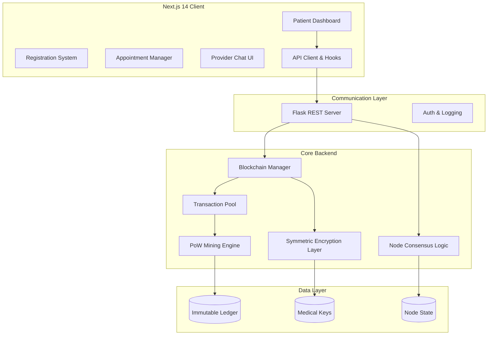

# Hack Knight '25: Secure Blockchain-Based Healthcare Management

[](https://opensource.org/licenses/MIT)
[](https://www.python.org/downloads/)
[](https://nextjs.org/)
[](https://www.typescriptlang.org/)
[](https://bun.sh/)
[](https://tailwindcss.com/)

Hack Knight '25 is a decentralized healthcare management ecosystem that leverages blockchain technology to ensure the integrity, security, and portability of medical records. By combining a robust Python-based blockchain backend with a high-performance Next.js frontend, the platform provides a transparent ledger for patient data, medical appointments, and provider interactions.

## Table of Contents

- [Overview](#overview)
- [Features](#features)
- [Architecture](#architecture)
- [Quick Start](#quick-start)
- [Usage](#usage)
- [Configuration](#configuration)
- [API Reference](#api-reference)
- [Development](#development)
- [Roadmap](#roadmap)
- [Contributing](#contributing)
- [License](#license)

---

## Overview

Traditional healthcare data management systems often suffer from fragmentation, lack of interoperability, and vulnerability to centralized points of failure. **Hack Knight '25** addresses these challenges by implementing a custom-built blockchain.

The system uses a **Proof-of-Work (PoW)** consensus mechanism to secure the ledger. Every medical record added to the system is hashed, linked to previous blocks, and distributed across the network nodes. With integrated **Fernet symmetric encryption**, sensitive patient data remains confidential, accessible only to authorized entities holding the decryption keys.

---

## Features

- **Custom Blockchain Core**: Native implementation of a linked-block structure with SHA-256 cryptographic hashing.
- **Proof-of-Work (PoW)**: Robust mining algorithm (Nonce-based) ensures network security and prevents record tampering.
- **Secure Medical Ledger**: Built-in encryption/decryption layer using `medical_encryption.key` to protect PHI (Protected Health Information).
- **Consensus & Synchronization**: Automatic conflict resolution utilizing the "Longest Chain Rule" for multi-node environments.
- **Advanced Patient Dashboard**: A modern React-based interface for managing health summaries, appointments, and viewing blockchain status.
- **Healthcare Data Models**: Specialized schemas for appointments, patient registration, and provider credentials.
- **Real-time Analytics**: Visual representation of blockchain health and transaction history.
- **Component-Driven Design**: UI built with Radix UI and Tailwind CSS, documented with Storybook.

---

## Architecture

The project follows a decoupled architecture, separating the heavy cryptographic logic of the blockchain from the user-facing application.



---

## Quick Start

### Prerequisites
- **Python**: 3.9+
- **Node.js**: 18+ or **Bun** (Recommended)
- **Git**

### 1. Installation

Clone the repository and install dependencies for both the frontend and the blockchain service.

```bash
# Clone the repository
git clone https://github.com/WomB0ComB0/hack-knight-25.git
cd hack-knight-25

# Install Root and Frontend dependencies
bun install

# Install Backend dependencies
cd blockchain
pip install -r requirements.txt
```

### 2. Launching the Services

The project provides a convenience script in the root `package.json` to start both the Python backend and the Next.js frontend concurrently.

```bash
# From the root directory
bun run dev
```

The application will be accessible at:
- **Frontend**: `http://localhost:3000`
- **Blockchain API**: `http://localhost:5000`

---

## Usage

### Mining a Block
New medical transactions are held in a "mempool" until they are mined. To finalize transactions:
```bash
curl -X GET http://localhost:5000/mine
```

### Adding a Medical Record
Transactions represent any healthcare event. Submit a POST request with the transaction details:
```bash
curl -X POST -H "Content-Type: application/json" \
-d '{
  "sender": "Doctor_ID_001",
  "recipient": "Patient_UUID_99",
  "amount": 1,
  "medical_data": "Observation: Patient exhibits normal recovery."
}' \
http://localhost:5000/transactions/new
```

### Synchronizing Nodes
If you are running multiple instances of the blockchain, trigger the consensus algorithm to ensure your node has the longest valid chain:
```bash
curl -X GET http://localhost:5000/nodes/resolve
```

---

## Configuration

### Backend: `blockchain/config.ini`
Controls the behavior of the blockchain engine.
- `difficulty`: Integer representing the leading zeros required for PoW (e.g., `4`).
- `reward`: The mining incentive (default `1`).

### Frontend: `frontend/.env`
Define the connection string for the blockchain network.
```env
NEXT_PUBLIC_BLOCKCHAIN_API=http://localhost:5000
NEXT_PUBLIC_APP_URL=http://localhost:3000
```

---

## API Reference

### Core Blockchain API
| Endpoint | Method | Description |
| :--- | :--- | :--- |
| `/chain` | GET | Retrieve the full blockchain and its length. |
| `/mine` | GET | Force the node to mine the current transaction pool. |
| `/transactions/new` | POST | Append a new healthcare record to the next block. |
| `/nodes/register` | POST | Register a new neighbor node (JSON list of URLs). |
| `/nodes/resolve` | GET | Resolve conflicts and synchronize with the network. |

### Application Specific API
| Endpoint | Method | Description |
| :--- | :--- | :--- |
| `/api/appointments` | GET | Fetch list of scheduled appointments. |
| `/api/appointments` | POST | Schedule a new patient-provider interaction. |
| `/api/health` | GET | Status check for the API and blockchain connectivity. |

---

## Development

### Directory Structure
```text
├── blockchain/             # Python Flask Backend
│   ├── app.py              # API routing logic
│   ├── blockchain.py       # Core logic (Block, Transaction, Hashing)
│   ├── auth_service.py     # User authentication/identity logic
│   └── healthcare_structure.py # Medical data schemas
└── frontend/               # Next.js Application
    ├── src/app/            # App Router (Pages, API routes)
    ├── src/components/     # UI Components (Shadcn/UI)
    ├── src/hooks/          # Custom React hooks (Data fetching)
    └── src/utils/          # API wrappers and loggers
```

### Component Standards
UI components are built using a "Atomic Design" philosophy. Reusable primitives are located in `src/components/ui/`, while feature-specific blocks (like the `PatientDashboard`) are in the parent components directory. Use Storybook for component isolation:
```bash
cd frontend
bun run storybook
```

---

## Roadmap

- [ ] **Phase 1**: Implement multi-signature authorization for record access.
- [ ] **Phase 2**: Integrate IPFS for large medical imaging (MRI/X-Ray) storage.
- [ ] **Phase 3**: Develop a React Native mobile application for patient access.
- [ ] **Phase 4**: Zero-Knowledge Proofs (ZKP) for identity verification without data exposure.

---

## Contributing

1. Fork the Project.
2. Create your Feature Branch (`git checkout -b feature/AmazingFeature`).
3. Commit your Changes (`git commit -m 'Add some AmazingFeature'`).
4. Push to the Branch (`git push origin feature/AmazingFeature`).
5. Open a Pull Request.

---

## License

Distributed under the MIT License. See `LICENSE` for more information.